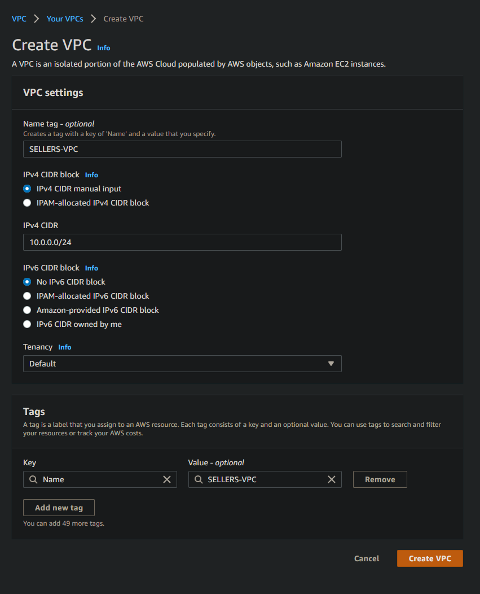

## Part 1 - Build a VPC

1. Create a VPC. 

2. Create a subnet 

3. Create an internet gateway 
   - Tag it with "YOURLASTNAME-gw"
   - Attach it to your VPC
4. Create a route table 
   - Tag it with "YOURLASTNAME-routetable"
   - Attach it to your VPC
   - Associate it with your subnet
   - Add a routing table rule that sends traffic to all destinations to your internet gateway
5. Create a security group 
   - Tag it with "YOURLASTNAME-sg"
   - Allow SSH for a set of trusted networks including:
     - Your home / where you usually connect to your instances from
     - Wright State (addresses starting with 130.108)
     - Instances within the VPC
   - Attach it to your VPC
   - Image should include your Inbound rules
6. (If necessary, else skip) Create a key pair 

## Part 2 - EC2 instances

1. Create a new instance. Give a write up of the following information:
   - I chose to use Ubuntu Server 20.4 LTS because I don't trust myself to use anything else
        - As usual, the default name would be `ubuntu`
   - t.2 micro
2. Attach the instance to your VPC. As discussed there are different pathways to doing this. Say how you did it.
    - I think all I had to do was select my VPC as the network for the machine, I also set the subnet to the VPC's subnet
3. Determine whether a Public IPv4 address will be auto-assigned to the instance. Justify your choice to do so (or not do so)
   - Since the subnet is already preconfigured to disable automatic public IPs, I'll just use the first available IP, 10.0.0.4, for the network interface
4. Attach a volume to your instance. As discussed there are different pathways to doing this. Say how you did it.
    - I just gave the root volume 16GB of gp2 storage, I think that should be good right?
5. Tag your instance with a "Name" of "YOURLASTNAME-instance". Say how you did it.
    - First I clicked on add another tag
    - Then under the "key" field, I typed in `Name` and for the "Value" field, I typed `SELLERS-Instance`
6. Associate your security group, "YOURLASTNAME-sg" to your instance. Say how you did it.
    - I clicked on the `Select an existing security group` button, then selected my security group
7. Reserve an Elastic IP address. Tag it with "YOURLASTNAME-EIP". Associate the Elastic IP with your instance. Say how you did it.
    - I was actually a little confused for a bit but I think I got it now, first I clicked on `Elastic IPs` under the `Network & Security` tab
    - Then I clicked  `Allocate Elastic IP Address` and allocated a new EIP address from Amazon pools of EIPs (I think?)
    - Next I pressed on my new EIP and then went to the `Actions` tab, and then clicked on `Associate Elastic IP address`
    - Lastly, I selected `Network interface`, then chose the name of my instance (SELLERS-instance) and it's private ip address (10.0.0.4) and associated the EIP
8. Create a screenshot your instance details and add it to your project write up.
   
9. `ssh` in to your instance. Change the hostname to "YOURLASTNAME-AMI" where AMI is some version of the AMI you chose. Say how you did it.
   1. It is wise to copy config files you are about to change to filename.old For `/etc/hostname`, for example, I would first copy the current `hostname` file to `/etc/hostname.old`
   2. You should not change permissions on any files you are modifying. They are system config files. You may need to access them with administrative privileges.
   3. Here is a helpful resource: https://www.tecmint.com/set-hostname-permanently-in-linux/ I did not modify `/etc/hosts` on mine - do so or not as you wish.
10. Create a screenshot your ssh connection to your instance and add it to your project write up - make sure it shows your new hostname.

## Submission

1. Commit and push your changes to your repository. Verify that these changes show in your course repository, https://github.com/WSU-kduncan/ceg3120-YOURGITHUBNAME

   - Your repo should contain:
   - `images` folder (optional depending on how you implement screenshots)
   - `README.md`

2. In Pilot, paste the link to your project folder. Sample link: https://github.com/WSU-kduncan/ceg3120-YOURGITHUBUSERNAME/blob/main/Projects/Project2

3. You may delete all created resources once done to save monies. No really, trash it - especially the instance and disassociate and release the elastic ip

## Rubric

[Link to Rubric](Rubric.md)